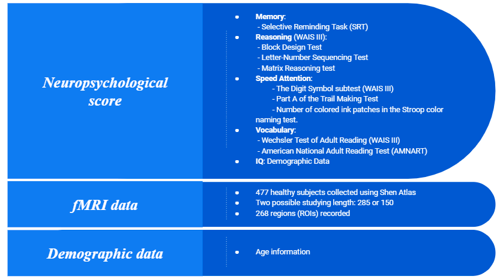
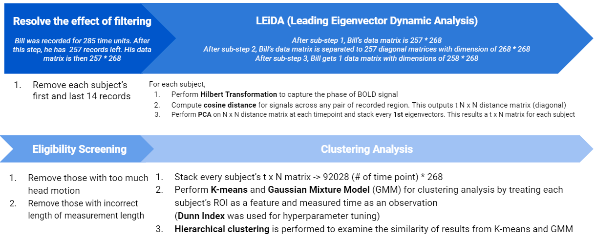
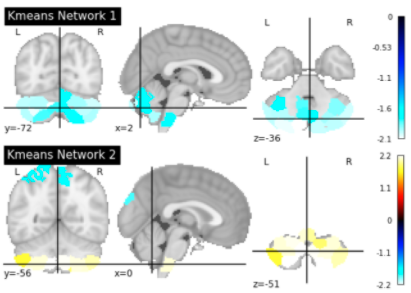
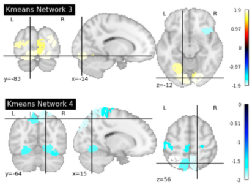

# About this site

This website is the official site for the project, *Analysis of Time-varying Brain Dynamics and Cognitive Correlates*. The project is led by [Professor Seonjoo Lee](https://sites.google.com/site/seonjool/) from Columbia University. Yiling Yang, a 2nd year MS Biostatistics student also from Columbia University, performed the major analysis. Their contact information can be found at the end of this page. The website is for introduction and code sharing for the project

# Introduction

In 2017, researchers suggested Leading Eigenvector Dynamic Analysis as a way to processing and cluster BOLD signals (Cabral, 2017). LEiDA analysis effectively extracts phase information of the BOLD signal while reducing the dimension of data. Back then, it was a good exploration of a new method. Varangies and et.al suggested the aging effect on cognitive declining in 2019 (Varangies, 2019).

In this research project, we aimed to further validate LEiDA using more comprehensive data (More observations and more recorded ROIs) and take the aging effect into account by including it in a correlation and regression analysis. Using data collected by Shen atlas and similar dynamic metrics in Cabral's paper, we led to a similar conclusion even after taking the aging effect into account. Meanwhile, we consider there is still space for improvement, especially in terms of algorithm selection during the clustering analysis process.

# Data

There are three datasets involved in this project. Demographic and Neuropsychological scores were required before the fMRI study. In later analysis, neuropsychological scores will be considered as primary interests or dependent variables. The demographic dataset contains age information for each subject, which is used as an adjustment for regression analysis. The fMRI data were used for clustering analysis and derivation of dynamic metrics (introduce later), which mainly served as independent variables in later analysis.

# LEiDA & Clustering Analysis

Before any analysis, we removed the first and last 14-time points data due to the effect of filtering. To capture the phase of a BOLD signal, we performed *Hilbert Transformation*, a decomposition method. Cosine distance matrix at each time point. For such distance matrix at each time point, we performed *PCA* and kept the *1st* eigenvector only. Since the distance matrix is diagonal, the speed of processing can be significantly improved. Data entries were reduced from $N^2$ to ${N(N-1)}\over{2}$. The process so far is so-called *Leading Eigenvector Dynamic Analysis* (*LEiDA*). After removed some subjects with incorrect measured length and too much head motion, we performed *K-means* and *Gaussian Mixture Model* clustering on the stacked dataset of every subject. For K-means, *Dunn Index* was used for hyperparameter tuning. Lastly, *hierarchical clustering* was used to review similarities between clusters found by K-means and GMM.

# Corr & Regression Analysis

K-means gives us a cluster label to every moment a subject was in during the corresponding session. After then, we define 4 dynamic metrics to describe each subject's brain behavior. All of them were used in later correlation and relation analysis. The previous study has found that age plays an important role in cognitive decline (Varangis, 2019). Given this information, we adjust the effect of independent variables by including the main effect and interaction effect of age. This is also helpful that it can be used to examine a potential confounding effect induced by age.

# Results

## Clustering Analysis

K-means found 4 centers in total. Ther are shown below. Visualization was made using nilearn package in Python.

{width=400px}{width=400px}

A summary of time length spent in each cluster was also created:

There are some key observations from results above. First, the proportions of time spent in each network are evenly distributed based on the summary table. Meanwhile, some people seem never to be in a certain network given that the minimum value can be 0. Another important aspect is that K-means is the main method suggested in Cabrel's paper. It's a distance-based method. However, the hierarchical clustering output (check below) made based on results from K-means and GMM shows that their clustering outcomes are very different. In the graph below, k* stands the *th center found by K-means and similarly for GMM.

As we can see, the number of clusters GMM found is double as that found by K-means. The differences in outcomes made by different algorithms are worth for future study that how consistent our results can be when using different types of clustering methods. Lastly, it's interesting that we didn't observe the default network, a network found to be active during resting state.

## Correlation Analysis (Pearson)

Through correlation analysis among neuropsychological scores and dynamic metrics, we found many significant correlations. This suggested it might be necessary to dive in more about their relationships (See results below), especially we can take age into account. We will talk more about this in the regression section.

## Regression Analysis

In terms of regression analysis, we found many significant effects. Without surprise, age is always a significant effect when combining with any independent variable. Results are summarized below. It's worth noting that when adding the interaction term between age and independent variable, none of them had a huge change in their main effect and no interaction was significant. This suggested the non-existence of confounding effects by age.

# Conclusion & Discussion 

- In addition to validating the methodology used by the previous study (Hilbert transformation and clustering analysis), We further identified many significant effects between identified networks and correlation with cognitive capabilities have. More importantly, those effects are adjusted by the aging effect
- Future researchers can further validate using different methods. Since clustering results tend to be different if we switch to  different types of clustering methods such as GMM
- Future researchers can also investigate one specific cognitive capability in detail given that we only performed relatively straightforward regression analysis

# Reference

- Cabral, J., Vidaurre, D., Marques, P. et al. Cognitive performance in healthy older adults relates to spontaneous switching between states of functional connectivity during rest. Sci Rep 7, 5135 (2017). https://doi.org/10.1038/s41598-017-05425-7
- Salthouse, T. A., Habeck, C., Razlighi, Q., Barulli, D., Gazes, Y., & Stern, Y. (2015). Breadth and age-dependency of relations between cortical thickness and cognition. Neurobiology of aging, 36(11), 3020–3028. https://doi.org/10.1016/j.neurobiolaging.2015.08.011
- Varangis E, Habeck CG, Razlighi QR and Stern Y (2019) The Effect of Aging on Resting State Connectivity of Predefined Networks in the Brain. Front. Aging Neurosci. 11:234. doi: 10.3389/fnagi.2019.00234

# Contributers

- [Seonjoo Lee](https://sites.google.com/site/seonjool/)
- Yiling Yang (yy3018@columbia.edu | yangyiling3018@gmail.com)

# Download Code

We decide to open source our code for future researchers. Please research out any of the contributors listed above if you have any questions

<a href="code.zip">Download Here</a>
