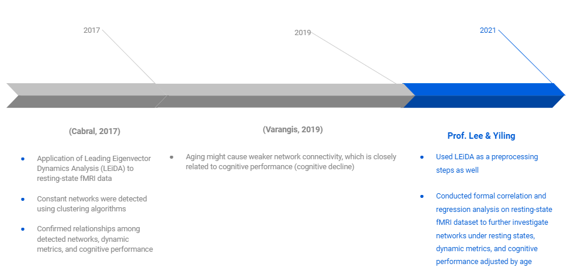
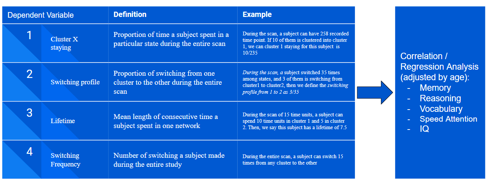
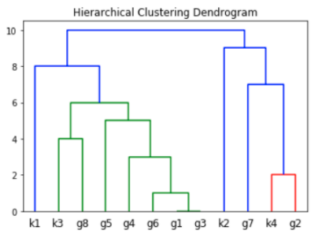
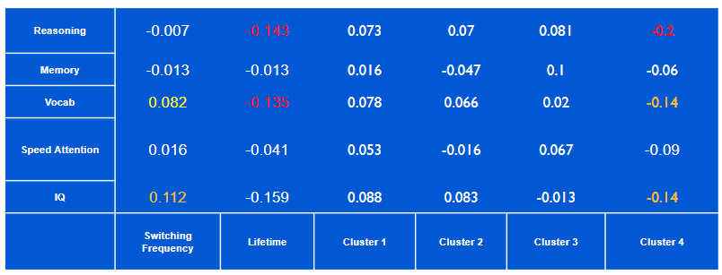
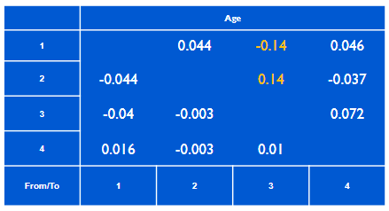

# About this site

This website is the official site for the project, *Analysis of Time-varying Brain Dynamics and Cognitive Correlates*. The project is led by [Professor Seonjoo Lee](https://sites.google.com/site/seonjool/) from Columbia University. Yiling Yang, a 2nd year MS Biostatistics student also from Columbia University, performed the major analysis. Their contact information can be found at the end of this page. The website is for introduction of the project and make code and slides open sources to those who are interested in this topic.

# Introduction

# Data

There are three datasets involved in this projects. Demographic and Neuropsychological scores were required before the fMRI study. In later analysis, neuropsychological score will be considered as primary interests or dependent variable. Demographic contains age information for each subject, which is used as an adjustment for regression analysis. The fMRI data were used for clustering analysis and derivation of dynamic metrics (introduce later), which mainly served as independent variables in later analysis.

# LEiDA & Clustering Analysis

Before any analysis, we removed first and last 14 time points data due to the effect of filtering. To capture the phase of BOLD signal, we performed *Hilbert Transformation*, a decomposition method. Cosine distance metrices at each time point. For such distance metrix at each time point, we performed *PCA* and kept the *1st* eigenvector only. Since dist nce matrix is diagnoal, the speed of processing can be significantly improved. Data entries were reduced from $N^2$ to ${N(N-1)}\over{2}$. Process so far is so-called *Leading Eigenvector Dynamic Analysis* (*LEiDA*). After removed some subjects with incorrect measured length and too much head motion, we performed *K-means* and *Gaussian Mixture Model* clustering on stacked dataset of every subject. For K-means, *Dunn Index* was used for hyperparameter tuning. Lastly, *hierarchical clustering* was used to review similarities between clusters found by K-means and GMM.

# Correlation & Regression Analysis

K-means basically gives us a cluster label to every moment a subject was in during corresponding session. After then, we define 4 dynamic metrics to describe subjecs' brain behavior. All of them were used in later correlaion and relation analysis. Previous study has found that age plays an importnat role in cognitive decline (Varangis, 2019). Given this information, we adjust effect of independent variables by including main effect and interaction effect of age. This is also helpful that it can be used examine a potential confounding effect induced by age.

# Results

## Cluster Analysis

K-means found 4 centers in total. Ther are shown below. Visualization was made using nilearn package in Python.

{width=400px}{width=400px}

A summary of time length spent in each cluster was also created:

There are some key observations from results above. First, the proportions of time spent in each network are evenly distributed based on the summary table. Meanwhile, some people seem never to be in a certain network give that minimum value can be 0. Another important aspect is that K-means is the main method suggested in Cabrel's paper. It's a distance-based method. However, the hierarchical clustering output (check below) made based on results from K-means and another model-based method. In the graph below, k* stands the *th center found by K-means and similarly for GMM.

Gaussian Mixture Model seemed to output very different results. The number of clusters GMM found is as double as that found by K-means. The different outcomes made by different algorithms is worth for future study that how consistent our results can be when using different types of clustering methods. Lastly, it's interesting that we didn't observe default network, a network found to be active during resting state.

## Correlation Analysis (Pearson)

# Download Code

<a href="code.zip">Download Here</a>
